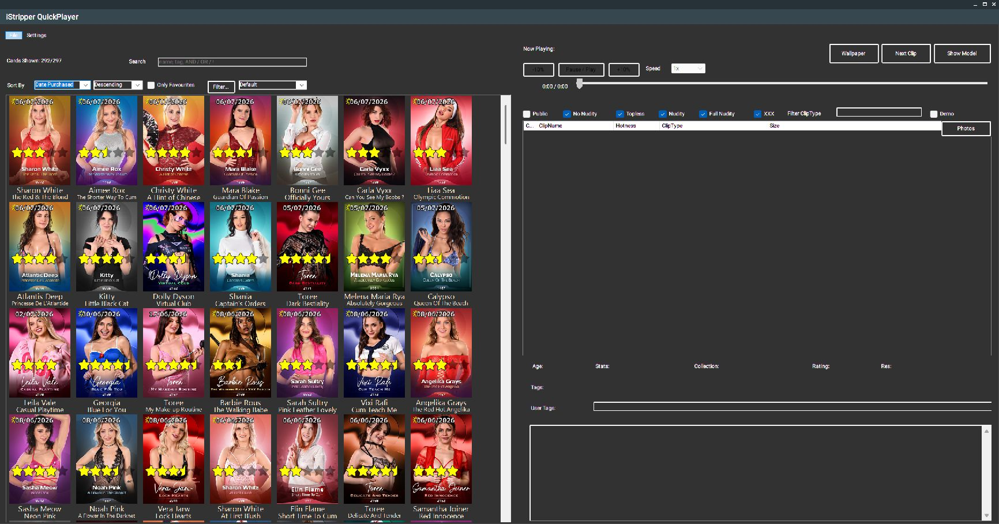
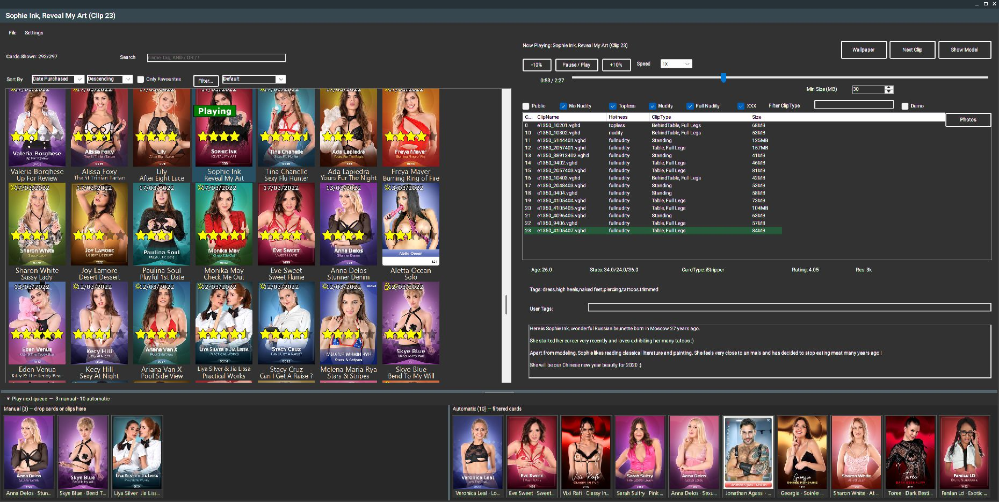
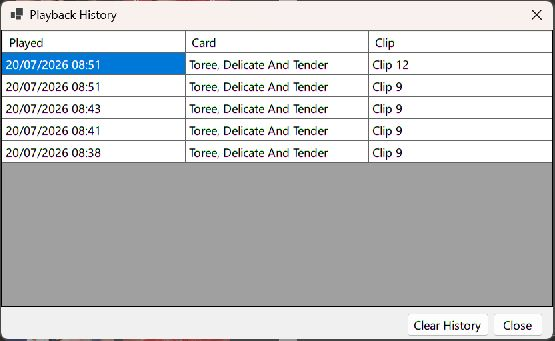
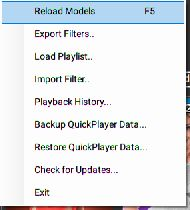
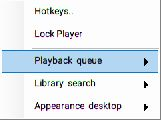
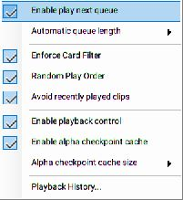

# iStripper QuickPlayer

[](https://github.com/KittyPingu/IStripperQuickPlayer/releases/latest)
[](https://github.com/KittyPingu/IStripperQuickPlayer/actions/workflows/release.yml)
[Project website](https://kittypingu.github.io/IStripperQuickPlayer/)

A Windows companion for browsing your local iStripper library, launching the
card or clip you want, and controlling compatible desktop playback.



QuickPlayer uses the cards already installed by iStripper. It does not download
or include shows.

## What QuickPlayer adds

### Browse your library visually

- Browse local cards as a resizable cover-art library.
- Search model names, show titles, descriptions and tags.
- Sort by model, age, rating, statistics, purchase date or release date.
- Add your own favourites, ratings and tags.
- Save and reload detailed card filters.
- Optionally restrict automatic playback to the cards and clips remaining
  after your filters are applied.
- Reload the library after buying or downloading new cards.

### Choose exactly what plays

- Select a card to see its available clips.
- Filter clips by explicitness, type and minimum file size.
- Start an individual clip or play the next clip.
- Use **Show Model** to filter the library to the performer currently showing,
  making it easy to browse only that model's shows and clips.
- Jump from **Now Playing** to the matching card.
- See the active clip highlighted in green when it is visible in the list.
- Randomize playback and optionally avoid recently played clips.

### Plan what plays next

The collapsible strip at the bottom of QuickPlayer shows two queues:

- drag a card into **Manual** to queue a clip from that card, or drag a clip
  row to queue that exact clip;
- drag queue entries to reorder them, or drag an entry out of the strip to
  remove it;
- drag the strip's top edge to resize it, and drag the centre divider to give
  either queue more room;
- save or load the manual queue as an `.iqpq` file from **File > Queue**;
- manual entries play first and are not changed when the library filter
  changes;
- **Automatic** is rebuilt from the cards currently visible after filtering.



Automatic queuing is disabled when **Enforce Card Filter** is off, while the
manual queue remains available. Queue support and automatic queue length are
configured under **Settings > Playback queue**. The queue's height and
manual/automatic split are remembered for the next launch.

### Control desktop playback

For eligible iStripper accounts, QuickPlayer can attach controls to the active
desktop animation:

- pause and resume;
- click or drag the timeline to seek;
- move backward or forward by 10% of the clip;
- restart the clip;
- select playback speeds from 0.25x to 4x;
- use configurable system-wide hotkeys while another app has focus.

> [!NOTE]
> Playback controls can take a few seconds to become available after a clip
> starts while QuickPlayer waits for its colour and alpha decoders to
> synchronize.

Modern clips use keyframe seeking and cached alpha checkpoints to keep the
colour video and its transparency mask synchronized. Legacy WMV clips are also
supported, with the compatibility notes described below.

### Fit playback into your desktop

- Make animation windows click-through with **Lock Player**.
- Create and apply a wallpaper from the current card.
- Choose wallpaper monitors, brightness, blur and desktop-icon behaviour.
- Keep QuickPlayer in the notification area with **Minimize to Tray**.
- Use either the light or dark interface.

### Backup your settings

A single `.iqpb` backup contains your settings, filters, ratings, tags,
favourites and playback history.

### Playback history

QuickPlayer records a local playback history and can avoid the 100 most recent
clips when alternatives are available. View it from
**Settings > Playback queue > Playback History**.



## Install and get started

QuickPlayer requires 64-bit Windows and an existing iStripper installation.

1. Download the latest `IStripperQuickPlayer-*-Setup.exe` from
   [GitHub Releases](https://github.com/KittyPingu/IStripperQuickPlayer/releases/latest).
2. Run the installer, then start iStripper and QuickPlayer.
3. Select a card to see its clips.
4. Select a clip to play it, or use **Show Model**.
5. Use **File > Reload Models** after adding cards to iStripper.

The File menu also contains playlist/filter import, queue save/load, backup,
restore and update commands.



## Search your cards

Search is case-insensitive and supports phrases, fields, negation, `AND`, `OR`
and parentheses.

| Search | Meaning |
| --- | --- |
| `kitty` | Find `kitty` anywhere in the indexed card details. |
| `"pool side"` | Find that exact phrase. |
| `rae AND pole` | Require both terms. |
| `(rae AND pole) OR kitty` | Return either group of matches. |
| `model:anna AND tag:duo` | Search particular fields. |
| `tag:blue AND !model:anna` | Exclude a term or field match. |

Available fields are `model`, `card`, `title`, `description` and `tag`.
Aliases such as `performer`, `name`, `show`, `outfit`, `desc` and `tags` also
work. Use explicit `AND` between separate requirements.

## Playback controls and hotkeys

Playback controls appear when:

- **Settings > Playback queue > Enable playback control** is selected;
- iStripper reports a Platinum-or-higher account level; and
- QuickPlayer safely recognizes the decoder used by the active desktop clip.

The default hotkeys are:

| Action | Default |
| --- | --- |
| Next clip | `Ctrl+Alt+N` |
| Next card | `Ctrl+Alt+C` |
| Pause / play | `Ctrl+Alt+P` |
| Back 10% | `Ctrl+Alt+Left` |
| Forward 10% | `Ctrl+Alt+Right` |
| Restart clip | `Ctrl+Alt+Home` |
| Toggle player lock | `Ctrl+Alt+L` |

Change or disable any shortcut from
**Settings > Hotkeys**. These are global Windows hotkeys, so they continue to
work while another application has focus.

Settings are grouped into **Playback queue**, **Library search** and
**Appearance desktop**, with frequently used **Hotkeys** and **Lock Player**
kept at the top level.




## Settings worth knowing

- **Avoid recently played clips** is enabled by default.
- **Enable play next queue** shows the collapsible manual and automatic queue
  strip; **Automatic queue length** controls how far it looks ahead.
- **Enable alpha checkpoint cache** speeds up repeated long seeks in modern
  clips and is enabled by default.
- **Alpha checkpoint cache size** defaults to 256 MB. Reducing the limit
  removes older cache entries until the cache fits.
- **Lock Player** makes every detected animation window click-through and also
  handles animation windows created later.
- **Wallpaper** controls automatic wallpaper generation and per-monitor
  options.
- **Enable playback control** completely disables playback attachment when
  turned off.

## Playback compatibility and limitations

- QuickPlayer controls one active desktop movie. It does not synchronize
  several simultaneous performer windows.
- Controls fail closed if the running x64 `vghd.exe` cannot be matched safely.
  iStripper 2.4.0.0 is the baseline and 2.3.0.3 has also been tested. Other
  versions are scanned and validated dynamically.
- Seek controls stay disabled while a new clip's colour and alpha decoders
  synchronize. Legacy WMV clips wait for at least 3.5 seconds of playback; the
  general readiness fallback is five seconds.
- The first long seek in a modern clip can be slower while its serial
  delta-alpha state is rebuilt. Later seeks benefit from saved checkpoints.
- Many legacy WMV files have no usable ASF keyframe index. QuickPlayer must
  restart those readers at frame zero and decode forward, so a long seek can
  take longer than the file size suggests.
- Legacy WMV speed is limited to 3x because sustained 4x playback can overrun
  iStripper's older colour/alpha compositor. Modern clips retain 4x.
- Clip audio is muted when speed is not 1x. Pitch-preserving audio stretching
  is not implemented.
- Buttons and the timeline are temporarily disabled while a seek is running.
  Seeking into the final second advances to the next clip.
- Playback control uses an analysed private iStripper interface rather than an
  official Totem API. A future incompatible version may leave the controls
  unavailable until support is updated.

## Backup, restore and updates

Use **File > Backup QuickPlayer Data** to create an `.iqpb` file. The backup
does not include downloaded cards, media files, generated wallpapers or the
alpha checkpoint cache; iStripper continues to manage the card library itself.

**File > Restore QuickPlayer Data** replaces the current QuickPlayer data and
restarts the app after confirmation.

Release builds check GitHub for updates. **File > Check for Updates** can
download the matching Setup executable, verify its SHA-256 digest, launch the
installer and close QuickPlayer.

## Troubleshooting

**Cards or cover images are missing**

Use **File > Reload Models** after iStripper has finished syncing or
downloading the cards.

**The playback controls do not appear**

Check the three playback requirements above, make sure a desktop animation is
running, and allow its decoders time to synchronize.

**A first seek is slower than later seeks**

Leave the alpha checkpoint cache enabled. QuickPlayer builds checkpoints while
modern clips play and reuses them on later seeks.

**Rating stars are missing on older Windows versions**

Install Microsoft's
[Segoe Fluent Icons font](https://learn.microsoft.com/windows/apps/design/style/segoe-fluent-icons-font).

## Building from source

The application targets .NET 10 for Windows and is built for x64. The native
playback bridge also requires the Visual Studio C++ build tools.

```powershell
dotnet build .\IstripperQuickPlayer\IstripperQuickPlayer.csproj `
  -c Release -p:Platform=x64
```

See the [native playback bridge notes](native/IStripperPlaybackBridge64/README.md)
for decoder, seeking and compatibility details.

Pushes and pull requests build a self-contained installer artifact. Pushing a
tag named `vX.Y.Z` creates or updates the matching GitHub release.

---

iStripper QuickPlayer is an unofficial community project and is not affiliated
with Totem Entertainment.
